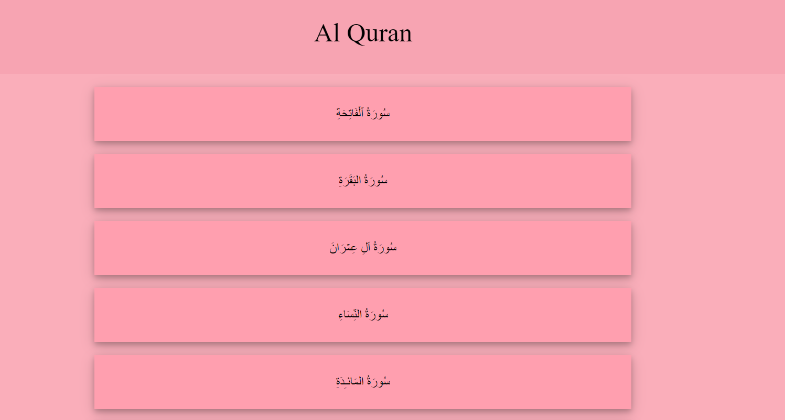
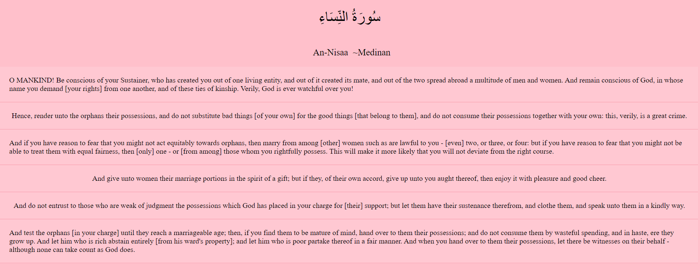

# Learning Node Basics :)

This is a simple Application for learning the basics for NodeJS.
 
I tried to practice:
 
👉 Creating Server  
👉  Server Request Handling  
👉  Async File reading  
👉  Managing JSON data from file  
👉  Server Request Handling  
 
Home Page has the lists of Surahs  

 
Surah Page has list of all ayahs  

